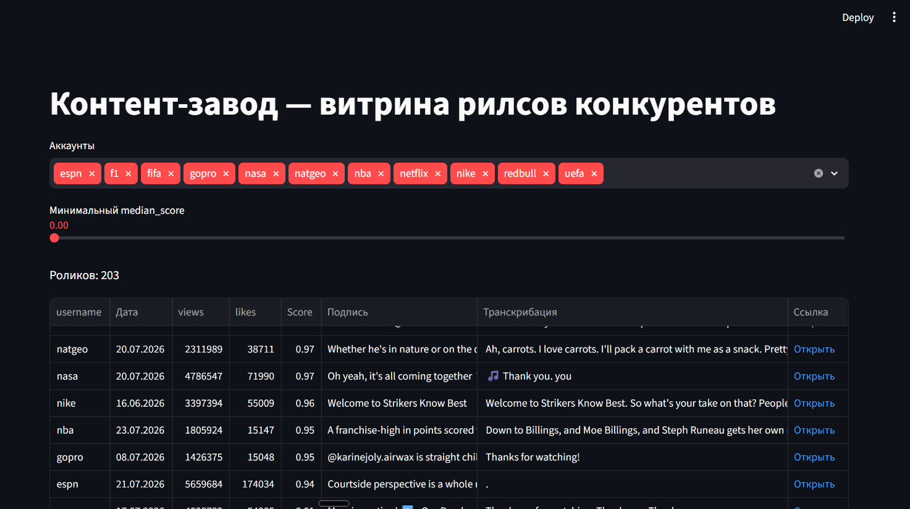

# Контент-завод

Портфолио-проект: система анализа Instagram-конкурентов для поиска идей контента,
которые «выстреливают» сильнее обычного.

## Зачем это нужно

Команда, снимающая контент, хочет знать: какие ролики у конкурентов оказались
неожиданно успешными — не просто набрали много просмотров (у крупных аккаунтов
это обычное дело), а превысили *свою собственную норму*. Такие ролики — сигнал
об удачной идее, которую стоит переснять.

Система сама собирает Reels у списка конкурентов, распознаёт текст ролика
(что там говорится), считает метрику «насколько это лучше обычного для
конкретного аккаунта» и показывает результат в таблице, которую можно
сортировать и фильтровать.



## Как считается успешность

```
score = просмотры ролика / медиана просмотров предыдущих роликов этого аккаунта
```

Медиана (а не среднее) — чтобы один случайный вирусный ролик в прошлом не портил
оценку остальных: медиана устойчива к таким выбросам. Берутся до 20 предыдущих
роликов, и не меньше 5 — иначе данных ещё мало для честной оценки.

Score = 20 значит «в 20 раз больше, чем обычно набирает этот аккаунт» — вне
зависимости от того, крупный это блогер или маленький.

## Как это устроено (пайплайн)

```
Apify (сбор Reels 50 конкурентов, включая превью-картинку thumbnailUrl)
   → PostgreSQL (сырые данные: просмотры, лайки, дата, ссылка, подпись, превью)
   → Groq Whisper (распознавание речи из видео → текст)
   → OpenRouter Vision (по превью-картинке → краткое описание видеоряда)
   → PostgreSQL (дозапись транскрибации, описания, расчёт метрики)
   → Streamlit (карточная витрина: превью, метрики, описание, фильтр по аккаунту и score)
```

## Стек и почему так

| Компонент | Выбор | Почему |
|---|---|---|
| Сбор данных | Apify (actor `parseforge/instagram-reel-scraper`) | Готовый скрапер публичных Reels без входа в личный Instagram-аккаунт — меньше риска бана |
| База данных | Локальный PostgreSQL + pgAdmin | Домен облачного Supabase оказался недоступен без VPN, и было решение не заводить облачный аккаунт — локальный Postgres не требует ни того, ни другого |
| Транскрибация | Groq API, модель `whisper-large-v3` | Бесплатный лимит, быстрая обработка; аудио вынимается из видео через `ffmpeg` |
| Описание видео | OpenRouter, бесплатная vision-модель `nvidia/nemotron-3-nano-omni-30b-a3b-reasoning:free` | Groq и Gemini на этом аккаунте оказались без доступа к vision (нет моделей / лимит 0) — OpenRouter сработал |
| Витрина | Streamlit | Карточная витрина с картинками и описаниями без написания HTML/JS с нуля |

## Как запускать

Из-за блокировок Apify/Groq/Instagram без VPN — перед каждым запуском скриптов
сбора и транскрибации нужно указывать SOCKS5-прокси (тот, что слушает локальный
VPN-клиент на `127.0.0.1:10808`):

```
cd src
$env:ALL_PROXY="socks5h://127.0.0.1:10808"
$env:HTTPS_PROXY="socks5h://127.0.0.1:10808"
$env:HTTP_PROXY="socks5h://127.0.0.1:10808"
python collect_reels.py
python transcribe_reels.py
python describe_reels.py
python calc_scores.py
```

Превью для роликов, собранных ДО этого обновления (у них нет `thumbnailUrl` из Apify),
добираются через `fetch_thumbnails_ig.py` — прямой запрос к странице `reel_url` с
`User-Agent: facebookexternalhit/1.1` (Instagram отдаёт og:image только соцсетевым
краулерам, обычным браузерным UA — JS-заглушку без метатегов):
```
python fetch_thumbnails_ig.py
```

`describe_reels.py` использует OpenRouter (`OPENROUTER_API_KEY` в `.env`, бесплатная
vision-модель `nvidia/nemotron-3-nano-omni-30b-a3b-reasoning:free`). Без пополнения
баланса OpenRouter даёт ~50 бесплатных запросов в сутки — скрипт нужно запускать
несколько дней подряд (по 10 роликов за раз), пока `video_description` не заполнится
у всех. С пополнением баланса ($10+) лимит вырастает до ~1000/день.

Локальный Postgres (localhost) через прокси не ходит и в нём не нуждается.

Веб-витрина:
```
streamlit run app.py
```
Откроется на `http://localhost:8501`.

## Текущее состояние

11 из 50 запланированных конкурентов, 203 ролика — упёрлись в бесплатный
месячный лимит Apify (`Monthly usage hard limit exceeded`). Транскрибация и превью
собраны у всех 203 роликов. Описание видео (video_description) — у 49 из 203,
остальное упирается в дневной лимит OpenRouter, добирается постепенно.
